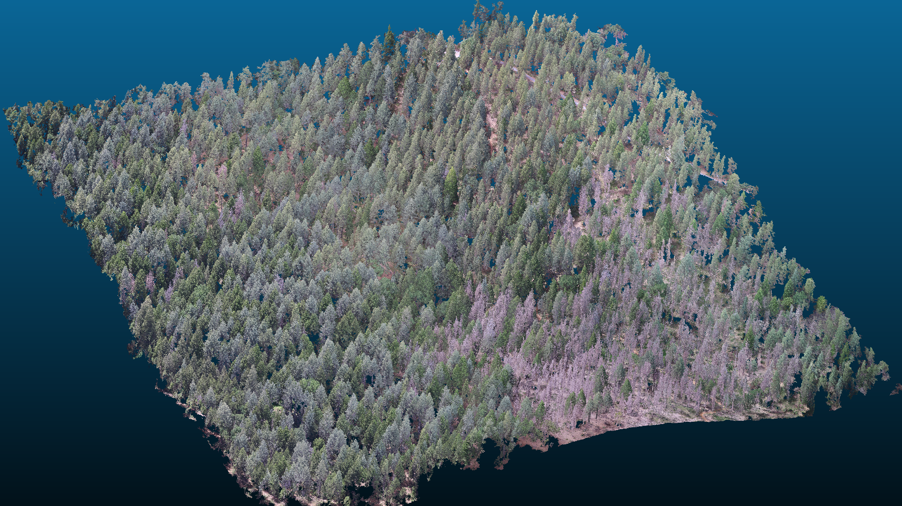
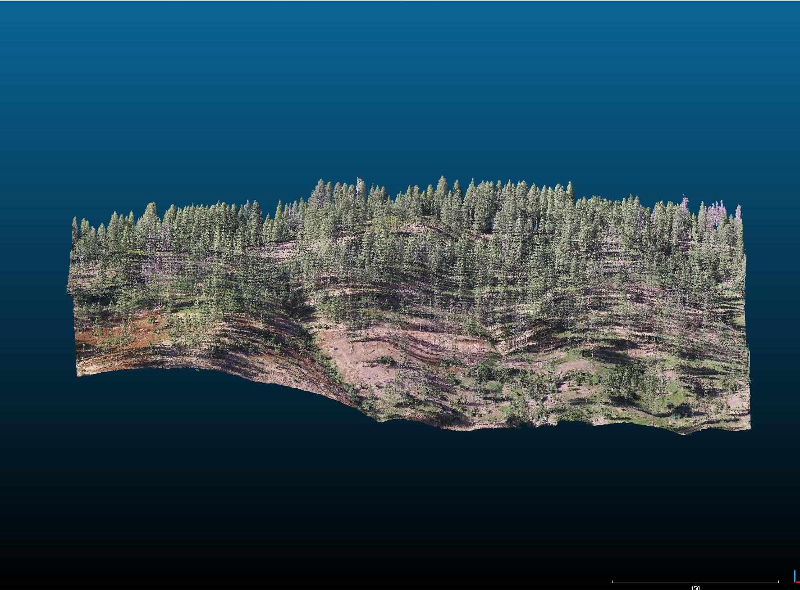
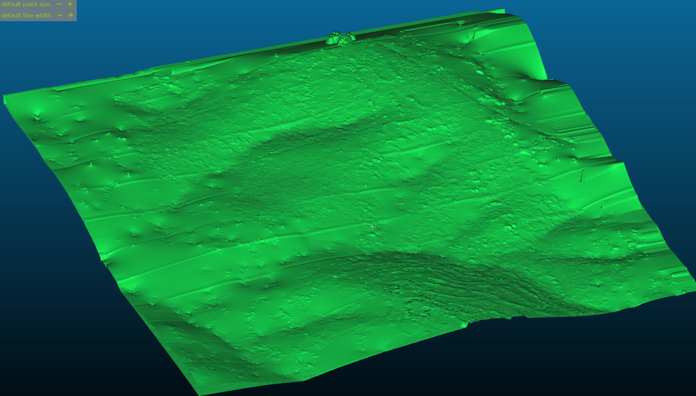

Analysis of forest structure data in yellow pine/mixed conifer forests of the Sierra Nevada Mountain Range and severity of western pine beetle in those forests.

Forest sites were chosen to have >40% ponderosa pine tree by basal area and >10% mortality of ponderosa pine tree by basal area.

The general workflow is:

1) Fly a grid pattern over a forested site using a DJI drone and the Map Pilot for iOS iPad app.
2) Take images every 2 seconds during the flight with lots of overlap between images.
3) Use photogrammetry (a.k.a. "structure from motion") software to turn the overlapping 2D images into a 3D point cloud, a 2D surface model, and a 2D orthomosaic. We use the Pix4D software and adjust processing parameters to best account for dense vegetation.
4) Use a point cloud manipulation software to classify the 3D point cloud into "ground" and "non-ground" points using a "cloth simulator filter". This filter also has the effect of using the classified "ground" points to generate a 2D continuous digital terrain model underneath the vegetation. We use CloudCompare for this.
5) Generate a "canopy height model" by subtracting away the CloudCompare generated terrain model from the Pix4D generated 2D surface model to leave just the surface representing the vegetation.
6) We use a variable window local maximum filter to identify the tree tops in the canopy height model. (In `R` using the `ForestTools` package)
7) We use a marker controlled watershed segmentation algorithm to identify the pixels in the orthomosaic that are associated with the individual trees. (Also in `R` and using the `ForestTools` package)
8) We extract the red, blue, and green values from the pixels of the orthomosaic representing each tree. We calculate the red-green index (RGI) as R / G and the red-green vegetation index as (R - G) / (R + G). We take the average and the 75th percentile of these 5 metrics across all pixels belonging to each tree.
9) Using QGIS, we overlay the polygons of the segmented crowns on top of the the RGB orthomosaic for the eldo_3k_1 site. We made a copy of the segmented crowns polygons and added an attribute field called "live". We then panned around the orthomosaic and manually changed the "live" field for 150 trees to 0 (for a dead tree) or 1 (for a live tree).
10) Using the 150 manually classified crown segments and their R, G, B, RGI, and RGVI data, We fit a generalized linear model using a binomial family and a logit link using all possible covariates to predict the probability that the tree represented by the crown segment was alive or dead.

Some photos of the processing:

This is one of the data products from the Pix4D processing of the 2D aerial imagery. Here, the point cloud is visualized using the CloudCompare software.

This is a portion of one of the other primary data products of the Pix4D processing-- an orthomosaic showing the top-down view of all objects in the scene with the spatial relationships amongst them preserved. This image is suitable for making measurments between the trees.

This is another view of a Pix4D generated point cloud from a different forest site, visualized in CloudCompare.

This is a view of just the points from the point cloud classified as "ground" after using the cloth simulator function in CloudCompare. Essentially, the trees from the previous image have been "deleted" off the landscape.

We can use the same "cloth" that helped classify ground versus non ground to interpolate the terrain underneath the trees, even where the trees may have obscured the ground.

The results of the tree top identification and crown segmentation steps can be seen by comparing the same orthomosaic above with the crown segment polygons overlaid on them.

